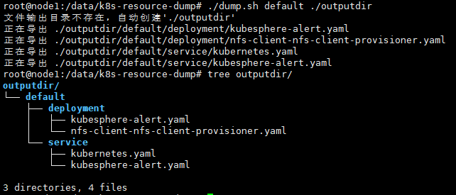

## Kubernetes资源导出工具
用于将Kubernetes已有的资源导出为yaml文件，目前仅支持**Deployment**和**Service**类型的资源导出

因平台差异(如Kubesphere与腾讯云)，会存在Yaml资源文件无法在不同平台的中使用，比如腾讯云的Deployment不能直接在Kubersphere平台中使用。另外已部署的资源文件存在多余字段, 这里工具使用模板文件重新渲染资源文件保存，以解决平台差异和多余字段的问题

## 文件清单
* dump.sh 资源导出脚本
* templates 模板文件目录
  * deployment.tpl **Deployment**资源类型模板
  * service.tpl **Service**资源类型模板

## 导出某个Namespace下的资源
导出**default**下的资源文件至<b>./outputdir</b>目录，当输出目录不存在会自动创建
```
./dump.sh default ./outputdir
```

